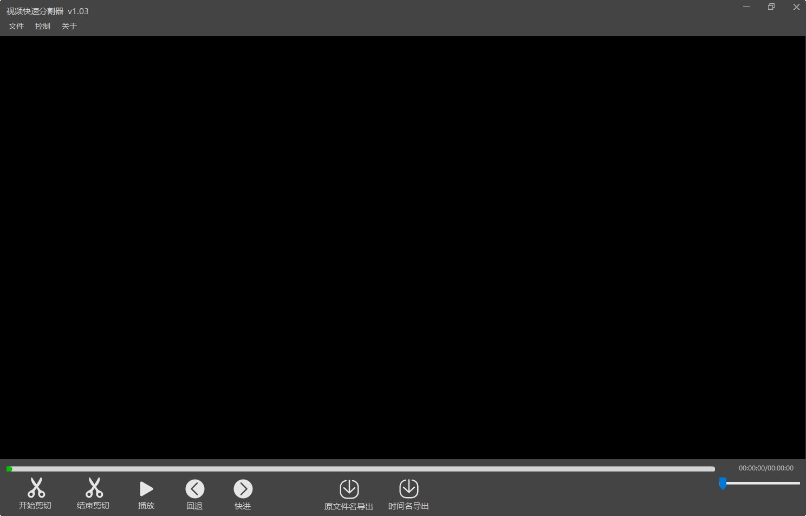

# MP4 快速分割器
> 这个软件的主要作用是能够快速对MP4文件进行分割，分割的速度是拷贝级别，硬盘的速度有多快分割的速度就有多块，因此这个软件对于MP4文件的预处理有非常方便的作用。
> 
> 我也尝试过网络上的"视频快速分割合并器“以及格式工厂，在使用过程中多少有些小瑕疵，因此开发了这款MP4快速分割器。这个分割器的视频分割功能部分是从Github上找的一个快速分割的代码，通过小的调整使代码正常工作，原来的仓库已经忘了，以后更新再补上注明。
> 
> 总之是个比较有意思的小项目，方案不算复杂，第一版设计也存在一些值得改进的地方，后续有空会继续优化方案设计的。

## 项目文件说明

* **MP4FastCutter GUI**：这个是MP4快速视频分割器的界面部分，我采用的是C#(winform) + vlcPlayer实现软件界面的编写和视频的播放，视频的分割部分我采用的是exe的命令行调用方式，简单粗暴，以后有时间再整成dll方式吧。
* **MP4FastCutter**：这个是mp4视频分割的核心部分，采用C语言编写。
* **TrackBar**：用户自定义的进度轴，主要是对要分割的进度部分进行变色显示，由于winform原生没有这种控件需要自己实现，这部分也是参考的CSDN的某个大佬的代码，忘了具体网址[擦汗]。
* **Enviroment**：由于采用是vs2013编写的界面，所以需要安装.Net运行环境才行，这个文件夹提供了.Net的安装包。
* **Docs**：使用文档以后再更新吧，目前就放了个截图

## 使用说明
部分人可能对这个软件的源码并没有兴趣，只关心它的使用。在win7虚拟机无环境情况下，按照下列方式可以使用。
1、下载这个代码
2、安装Enviroment中的.Net环境
3、运行\MP4FastCutter GUI\bin\x64\Release中的mp4Cutter.exe即可